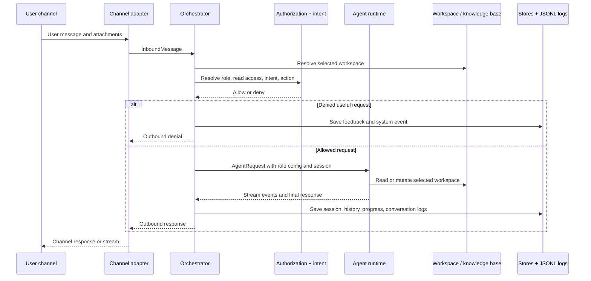

# Architecture

This service is a layered gateway for knowledge-base and workspace agents. Users may send messages
from TUI, HTTP APIs, browser pages, Enterprise WeChat, or future channels, but every channel must
normalize its input and supported attachment metadata into the same core message contract and hand
it to the gateway.

## Target Flow

```text
User channel
  -> channel adapter
  -> message gateway
  -> request authorization gate (role, read permission, intent, intent permission)
  -> agent runtime adapter
  -> selected workspace / knowledge base
```



The gateway is the only place that coordinates the business flow:

1. receive a normalized `InboundMessage`;
2. resolve the selected workspace or knowledge base;
3. evaluate request authorization:
   - identify the user role;
   - check workspace read permission;
   - classify the user's intent;
   - map the intent to the required permission action;
4. deny and record feedback when the intent is useful but not allowed;
5. call the configured `AgentRuntime` when the request is allowed;
6. persist session, history, feedback, progress, and conversation logs.

## Layers

### 1. Channel Adapters

Channel adapters own transport details and nothing else. They parse inbound payloads, build
`InboundMessage`, call the gateway, and translate `OutboundMessage` back to the channel.

Current examples:

- HTTP and browser dev page routes in `src/server/createServer.ts`
- Enterprise WeChat smart bot adapter (WebSocket long connection) in `src/wechat/wechatSmartBotAdapter.ts`

Future examples:

- TUI adapter
- public HTTP API adapter
- Slack, Feishu, DingTalk, or other chat adapters

Channel adapters must not decide roles, permissions, intent, workspace access, or agent SDK
behavior.

### 2. Message Gateway

The gateway implements `MessageGateway`. It is the application orchestration layer and should stay
provider-neutral.

Current implementation:

- `src/core/orchestrator.ts`

Gateway responsibilities:

- command handling such as `/help` and `/new`;
- workspace resolution through `KnowledgeWorkspaceResolver`;
- request authorization through the request authorization gate, backed by `AuthorizationService`
  and intent classification;
- feedback capture through `FeedbackStore`;
- runtime selection through `AgentRuntime` or `AgentRuntimeFactory`;
- session and history persistence;
- progress and final conversation logging.

The gateway must not import Enterprise WeChat, Claude SDK, MiniMax, GitHub, Codex SDK, pi-agent SDK,
or future provider SDK types directly.

### 3. Loop Control Plane

The loop module (`src/loop`) implements a goal-driven, verifiable, recoverable continuous execution
system on top of the existing single-turn message gateway. It follows the `plan -> act -> observe ->
verify -> decide` cycle and does not import provider SDKs or channel adapters directly.

Current implementation:

- `LoopService`: state machine driving run-level (`queued -> running -> completed/failed/paused/cancelled`)
  and step-level (`plan -> act -> observe -> verify -> decide`) transitions.
- `LoopStore`: persistence contract for definitions, runs, steps, and checkpoints.
  Phase 0 uses `InMemoryLoopStore`; Phase 1 will add SQLite-backed persistence.
- `ActionExecutor`: abstract execution seam. LoopService calls `ActionExecutor.execute()` with
  `LoopExecutionContext`, an action description, and an `AbortSignal`. The executor returns structured
  `ActionResult` with output, token usage, and evidence. This seam keeps the loop core independent of
  `MessageGateway`, Claude, CodeBuddy, Pi, or any specific runtime.
- `LoopExecutionContext`: correlation context (`loopRunId`, `stepId`, `attempt`, `idempotencyKey`,
  `requestedBy`, `executionPrincipal`, `authorizedPolicyVersion`) that flows through every log event,
  executor call, and observable artifact.
- `LoopEventLogger`: structured event logging (`loop.started`, `loop.step.*`, `loop.completed`, etc.)
  to the system JSONL log, carrying full execution context on every event.

Key design constraints:

- Loop module depends only on its own types and `ActionExecutor`. It does not import `src/core`,
  `src/agent`, `src/wechat`, or `src/server`.
- AbortSignal propagates from trigger through LoopService to ActionExecutor for cancellation.
- Interrupted steps are never directly replayed; recovery creates new steps that re-observe external
  state before deciding next action.
- Step leases with claim owners prevent concurrent execution of the same step.
- The `loop_manage` capability controls who can create, start, stop, cancel, and view loop runs.

### 4. Domain Services And Stores

Domain services answer business questions for the gateway:

- `AuthorizationService`: maps user -> role, and role + action -> allow/deny.
- `IntentDetectionService`: classifies the user's request as query, mutation, or knowledge-base update.
- `KnowledgeWorkspaceResolver`: selects the knowledge-base root or source repository workspace.
- `FeedbackStore`: records denied-but-useful requests for later review.
- `RoleConfigStore`: stores role prompts, capabilities, model selection, and allowed tools.
- session and history stores keep conversation continuity independent of the channel.

Database-backed implementations belong in `src/persistence`. Static or development implementations may live
in focused adapter folders such as `src/auth` or `src/workspace`.

### 5. Agent Runtime Adapters

Agent SDKs sit behind `AgentRuntime`. Adding a new SDK means adding a runtime adapter, not changing
channel adapters or gateway policy.

Current examples:

- `ClaudeSdkAgentRuntime` in `src/agent/claude`
- `CodebuddySdkAgentRuntime` in `src/agent/codebuddy`
- `PiAgentRuntime` in `src/agent/pi`

Future examples:

- `CodexSdkAgentRuntime`
- another Claude-compatible or custom runtime

Runtime adapters may know provider SDK details. They receive an already-authorized `AgentRequest`
with the selected workspace path, user text, role-derived configuration, session id, and stream
callbacks.

### 6. Infrastructure

Infrastructure modules provide storage, logging, configuration, and server lifecycle:

- `src/config`: model and endpoint configuration
- `src/persistence`: SQLite-backed role and feedback stores
- `src/logging`: JSONL logs
- `src/harness`: local workspace fixture and smoke harness
- `src/index.ts`: composition root that wires concrete adapters into system contracts

`src/index.ts` may import concrete adapters because it is the composition root. Core orchestration
code should depend only on system contracts.

## System Contracts

Stable system contracts are exported from `src/core/index.ts`. Module-specific public contracts are
exported from each module's `index.ts`.

Important contracts:

- `MessageGateway`: the gateway entry point used by every channel adapter.
- `InboundMessage`: provider-neutral user input, including text and optional uploaded attachment
  metadata for documents or images. Channel adapters own upload transport, validation, and storage
  before constructing it.
- `AgentRuntime`: provider-neutral execution interface for Claude, pi-agent, Codex, or future SDKs.
- `AgentRuntimeFactory`: creates a role-specific runtime from role configuration.
- `AuthorizationService`: role lookup and capability checks.
- `IntentDetectionService`: intent classification before runtime execution.
- `KnowledgeWorkspaceResolver`: workspace or knowledge-base selection.
- `FeedbackStore`: denied intent capture.
- `RoleConfigStore`: role, prompt, capability, tool, and model configuration.
- `ConversationSessionStore` and `ConversationHistoryStore`: channel-independent conversation state,
  keyed by `(channel, userId, workspacePath, chatId?)`. The optional `chatId` isolates group chats
  from each other and from single chats within the same channel.

Loop-specific contracts are exported from `src/loop/index.ts`:

- `LoopService`: state machine for goal-driven continuous execution (`startRun`, `cancelRun`, `pauseRun`,
  `resumeRun`, `recoverInterruptedSteps`).
- `LoopStore`: persistence contract for definitions, runs, steps, and checkpoints.
- `ActionExecutor`: abstract execution seam between LoopService and concrete runtime execution.
- `LoopExecutionContext`: correlation context flowing through every loop operation and log event.
- `LoopDecision`: discriminated union (`complete`, `continue`, `pause`, `fail`, `retry`) produced by
  the decide phase.
- `LoopDefinition`, `LoopRun`, `LoopStep`: domain objects with Zod-validated schemas.
- `LoopEventLogger`: structured event logging with `createLoopEvent` helper.

## Adding A New Channel

1. Create a channel adapter folder, for example `src/tui` or `src/api`.
2. Convert the channel payload into `InboundMessage`.
3. Call the injected `MessageGateway`.
4. Convert `OutboundMessage` and stream/progress events back to the channel's response shape.
5. Add the adapter to `src/index.ts` or a small composition module.

No role, permission, intent, or SDK logic should be added to the channel adapter.

## Adding A New Agent SDK

1. Create an adapter package under `src/agent`, for example `codex/codexSdkAgentRuntime.ts`.
2. Implement `AgentRuntime`.
3. Convert `AgentRequest` into the provider SDK request shape.
4. Convert provider responses and streams into `AgentResponse` and `AgentStreamEvent`.
5. Export the public runtime from the package `index.ts`.
6. Register the runtime in the composition root or runtime factory.

Do not import provider SDK types into `src/core`.

## Adding A New Permission Or Tool

1. Add the smallest new `RoleCapability` to the auth/core public contract that owns the capability.
2. Store it in role configuration through `RoleConfigStore`.
3. Map user intent or gateway actions to the capability in `AuthorizationService`.
4. Add focused tests for allow and deny behavior.

Permissions should be checked before calling `AgentRuntime`. When a user's intent is useful but not
allowed, the gateway should return a clear denial and save the request into feedback.

## Adding A New Loop Definition

1. Define a `LoopDefinition` with goal, workspace, role, iteration/time/token budgets, and verification
   strategy.
2. Ensure the requesting user has the `loop_manage` capability.
3. Optionally create a custom `ActionExecutor` that wires to `MessageGateway` or another execution
   backend.
4. Call `LoopService.startRun(definitionId, requestedBy)` to begin execution.
5. Monitor progress via `LoopStore` queries or `LoopEventLogger` events in `system.jsonl`.

Loop definitions are provider-neutral. The loop core does not import agent SDKs, channel adapters, or
the message gateway. All execution goes through the `ActionExecutor` seam.

## Dependency Rule

Dependencies point inward:

```text
channel adapters  -> core contracts
agent adapters    -> core contracts
db adapters       -> core contracts
loop module       -> loop contracts + ActionExecutor (no core/agent/channel deps)
composition root  -> all adapters
core gateway      -> core contracts only
```

Provider-specific code stays behind adapters. The gateway decides business flow; adapters translate
between the outside world and stable system contracts.
